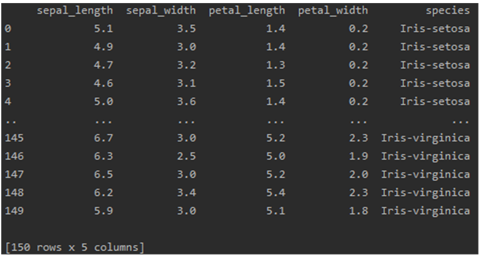
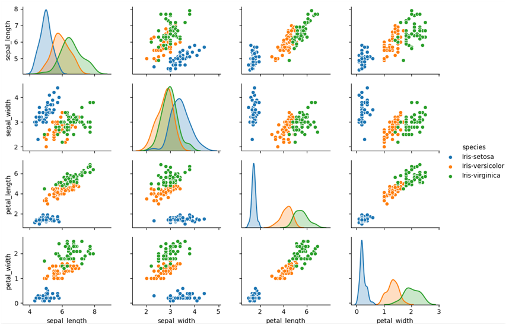

# Iris_deeplearning
> 학부생 3학년 2학기 때 진행한 붓꽃 분류 문제 학습

## Installation

-

## Usage example

파이썬 기본 모듈만을 사용하여 붓꽃 분류 문제 해결

## Development setup

Python 3.7

## Release History

* 1.0.0
    * first
    * 실습 완료

## Meta

김준혁 – wnsgur1198@naver.com

## Contributing

1. Fork it (<https://github.com/yourname/yourproject/fork>)
2. Create your feature branch (`git checkout -b feature/fooBar`)
3. Commit your changes (`git commit -am 'Add some fooBar'`)
4. Push to the branch (`git push origin feature/fooBar`)
5. Create a new Pull Request

<!-- Markdown link & img dfn's -->
